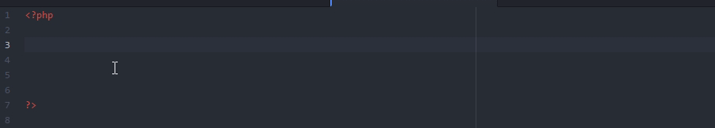
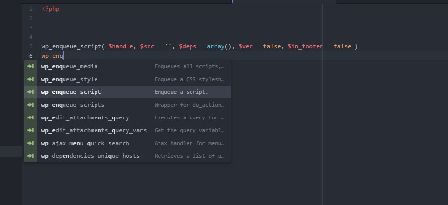

# WordPress AutoComplete
==================

##### Gif Preview

##### Image Preview

This is a collection of WordPress  autocompletions for Atom.io

- License: GNU/GPL
- Version: 1.1.3
- Extension URI: https://github.com/burhandodhy/wordpress-autocomplete

### Features

Autocomplete for:

    WordPress version : 4.7.3

    Functions  : 2821

### Installation
------------
Open **Settings** → **Install** and search for `wordpress-autocomplete`.

Alternatively, install through command-line:

	apm install wordpress-autocomplete

### Changelogs
- Version 1.1.3: Meta Update
- Version 1.1: Initial Start (Support all WordPress 4.7.3 function).
